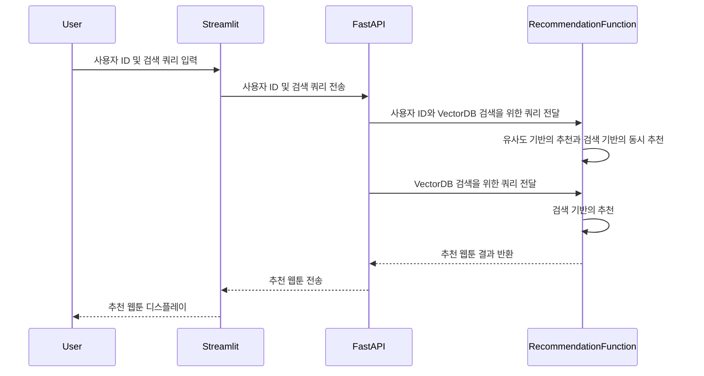

## Simple Recommenation Engine


### Dataset
- [Kaggle: Anime Recommendation Database 2020](https://www.kaggle.com/datasets/hernan4444/anime-recommendation-database-2020)
    - anime.csv
    - anime_with_synopsis.csv
    - 위 두 데이터는 아래 코드를 통해 조인하여 사용
    
    ```python
    merged_anime = pd.merge(anime_with_synopsis, anime, how="left").dropna()
    ```
- [Kaggle: Webtoon Comics Dataset](https://www.kaggle.com/datasets/swarnimrai/webtoon-comics-dataset)
---

### Overview
- 본 프로젝트는 사용자의 애니메이션 경험에 기반하여 사용자가 흥미로울만한 웹툰을 추천하는 엔진이다. 이 추천 시스템은 단순히 정수형태의 사용자의 ID를 받아 해당 사용자에게 웹툰을 추천한다. 애니메이션 데이터 내의 사용자가 Rating 9점 이상을 준 애니메이션 정보를 활용하여 웹툰의 정보와 코사인 유사도를 측정, 유사한 웹툰을 추천하는 서비스이다.

### Techical Stack
- 추천 모델: Hugging Face의 Sentence-Transformer에서 제공하는 임베더를 활용하며 그 중에서 간단한 `paraphrase-distilroberta-base-v1`를 활용하여 임베딩을 수행하여 유사도 기반으로 웹툰을 추천
    - OpenAI의 클로즈드 임베딩과 그 외 다양한 오픈소스 임베딩 모델을 사용할 수 있지만, 데이터의 규모가 크지 않기 때문에 경량화된 모델을 선택하고, 문장 유사도 계산이 용이한 `paraphrase-distilroberta-base-v1`를 사용.
    - 문장은 Pandas DataFrame에서 아래와 같은 방식으로 생성한다.
    ```python
    def get_webtoon_description(row):
    # Create description for one row
    description = (
        f"{row['Name']} has a subscribers {row['Subscribers']}. \n" 
        f"Summary: {row['Summary']}.\n"
        f"It was produced by {row['Writer']}.\n"
        f"Its genres are {row['Genre']}.\n"
    )
    return clean_text(description)
    ```
- API: 간단한 Serving 및 데이터 전송을 위해 빠른 API 구현에 최적화된 FASTAPI를 사용
- 사용자 인터페이스: 프로로타입 시험을 위해 간단히 프론트엔드 기능을 구현할 수 있는 Streamlit을 사용

### Problem Statement
- 문제점: 웹툰 데이터에는 아이디, 작가, 장르, 평가, 구독, 요약문 등이 포함되어 있지만, 어떤 사용자가 어떻게 평가했는지에 대한 데이터가 없어 사용자 경험을 반영한 추천 모델을 만들기가 어려움.
- 해결 방안: 애니메이션 데이터에는 사용자 경험이 포함되어 있음. 웹툰과 애니메이션의 경우 미디어는 다르지만, 웹툰이 애니메이션화가 되기도 하듯, 장르 컨텐츠의 유사성이 존재하기 때문에 특정 장르의 애니메이션을 선호하는 사용자가 비슷한 장르의 웹툰을 선호할 것이라는 가설을 세울 수 있음.
- 구현 방안: 임베딩 모델을 통해 애니메이션 데이터에 대한 Description을 학습하고, 이와 유사하게 웹툰의 데이터에 대한 Description을 학습하여, 두 개의 임베딩 데이터를 구축하여, 임베딩 데이터 간의 유사성을 계산하여 애니메이션과 웹툰과의 유사성을 측정할 수 있음.
- 결과: 애니메이션 데이터의 사용자가 애니메이션을 평가한 결과를 이용하여 사용자가 선호하는 애니메이션을 추출, 추출한 애니메이션과 유사한 웹툰을 추천하는 형태로 기능을 구현.



### Getting Started
```
Python: 3.11.9 and Install on your system requirements.txt.
```
- 설치 방법
    1. git clone https://github.com/Rakdol/Simple-Recommendation-Engine.git
    2. 프로젝트 폴더로 이동
    3. pip install -r requirements.txt
    4. Kaggle에서 다운 받은 데이터를 프로젝트의 data 폴더 내에 anime_merged.csv, rating_complete.csv, Webtoon Dataset.csv 저장
- Running FASTAPI
    - 코드상에 디폴트 포트가 5020으로 지정, 편의에 따라 수정 가능
    - src/app에서 fastapi 실행
    ```bash
    uvicorn app:app --reload --port=5020
    ```
- Running Streamlit
    - 포트는 편의에 따라 수정 가능
    ```bash
    streamlit run main.py --server.port 8002  
    ```
- ScreenShot:
    - 사용자 ID와 검색 쿼리 기반의 웹툰 추천
    - ID에 맞는 웹툰 추천 및 추천의 소스가 된 애니메이션 목록 표출
    - 검색 쿼리 기반의 웹툰 추천
    - 상위 5개의 웹툰 목록 표출
<p align="center">

</p>

### Limitations
- 경량화 모델 기반의 임베딩이지만 최적화 문제로 추천까지 실행시간이 다소 있음.
    - logging을 통해 함수 실행시간 계산
    - cosine_similarity 는 충분히 빠르다
    - get_simliar_animes에 의해서 속도가 지연되는 것으로 확인
    ```log
    INFO - Execution time for get_preferred_anime_from_user: 0.1072 seconds
    INFO - Execution time for get_simliar_animes: 0.8657 seconds
    INFO - Execution time for cosine_similarity: 0.1021 seconds
    INFO - Execution time for get_relevant_webtoons: 0.9707 seconds
    INFO - Execution time for get_simliar_animes: 0.8825 seconds
    INFO - Execution time for cosine_similarity: 0.0901 seconds
    INFO - Execution time for get_relevant_webtoons: 0.9755 seconds
    INFO - Execution time for get_recommenations: 1.9463 seconds
    ```
    - 타겟 애니메에 대해서만 유사도 계산, numpy 활용을 통한 속도 개선
    ```log
    INFO - Execution time for get_preferred_anime_from_user: 0.1166 seconds
    INFO - Execution time for get_simliar_animes: 0.0439 seconds
    INFO - Execution time for cosine_similarity: 0.0732 seconds
    INFO - Execution time for get_relevant_webtoons: 0.1196 seconds
    INFO - Execution time for get_simliar_animes: 0.0453 seconds
    INFO - Execution time for cosine_similarity: 0.0712 seconds
    INFO - Execution time for get_relevant_webtoons: 0.1214 seconds
    INFO - Execution time for get_recommenations: 0.2410 seconds
    ```

- 웹툰과 애니메이션 데이터의 언어가 영어로 되어 있어 한국어 명령 등 사용이 어려움.
- 애니메이션의 데이터가 웹툰에 비해 비대하고 장르 구분 등 보다 구체적인 설명이 애니메이션 데이터에는 제공되고 있지만 웹툰 데이터에 대해서는 상대적으로 적은 정보가 존재.
- 현재 단순하게 사용자의 ID 만을 입력을 받도록 되어 있지만, 향 후 장르에 대한 설명 등의 자연어 처리와 VectorDB와 RAG를 통한 시맨틱 검색을 활용하면 파인튜닝 없이도 보다 범용적인 추천을 구현할 수도 있을 것으로 예상 (Faiss 기반의 VectorDB 및 간단한 RAG 구현)
